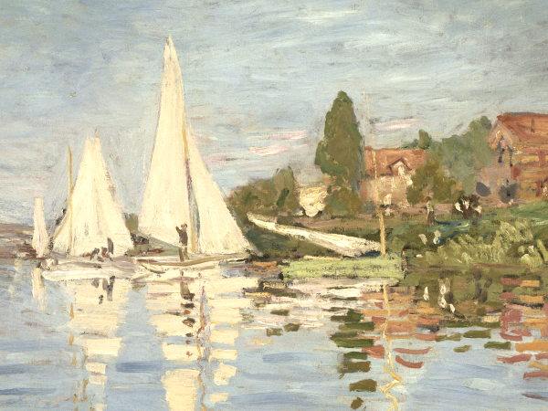

<!-- README.md is generated from README.Rmd. Please edit that file -->

```{r, include = FALSE}
knitr::opts_chunk$set(
  collapse = TRUE,
  comment = "#>",
  fig.path = "notes/figures/",
  out.width = "100%",
  dpi=130
)
```

# pictplot

<!-- badges: start -->
[](https://cran.r-project.org/package=pictplot)
[](https://cran.r-project.org/package=pictplot)
[](https://cran.r-project.org/package=pictplot)
[](https://cran.r-project.org/package=pictplot)
[](https://choosealicense.com/licenses/mit/)
<!-- badges: end -->

This is an R package that contains a lot of basic image processing functions.

## Dependencies

Mac users need to install XQuartz (https://www.xquartz.org/).

## Installation

This package is currently not available on CRAN. The development version of the package can be installed vie GitHub.

### Installation via GitHub

You can install the development version of the ```pictplot``` package via GitHub, by using the ```devtools``` package.

```{r, eval=FALSE, echo=TRUE}
# install the devtools package
install.packages("devtools")
```

__NOTE:__  
To install a package from GitHub,  
- On Windows, <a href="https://cran.r-project.org/bin/windows/Rtools/">Rtools</a> needs to be installed.  
- On Mac, XCode may be needed to be installed.

After you have installed the required software stated above, install the package as follows:

``` r
# install the pictplot package
devtools::install_github("tsuda16k/pictplot")
```

Then, load the package.

```{r}
library(pictplot)
```

## Example image

The ```pictplot``` package includes an image data, which is useful when you want to see how a function works right away. The variable name of the image is ```regatta```.

Internally, this is just a numeric array of size 450 x 600 x 3 [y-coordinate, x-coordinate, color channel], meaning that it is 450 pix height and 600 pix width, and has three color channels (Red, Green, and Blue). Each element of the array represents a pixel value, which can range between 0 and 1.

```{r}
dim(regatta)
```

Image size information can be shown by typing the variable name.

```{r}
regatta
```

To plot an image, use the ```plot()``` function.

```{r, eval=FALSE, echo=TRUE}
plot(regatta)
```



## Load an image

To load an image you like, use the ```im_load()``` function.

```{r, eval=FALSE, echo=TRUE}
im = im_load("path/to/your/image.jpg")
```

The jpg, png, and bmp formats are supported.

You can load an image from the web (URL). For example, 

```{r, eval=FALSE, echo=TRUE}
im = im_load("https://raw.githubusercontent.com/tsuda16k/pictplot/master/notes/face.png")
plot(im)
```

will load an image of a face.


## Functionality

WIP
